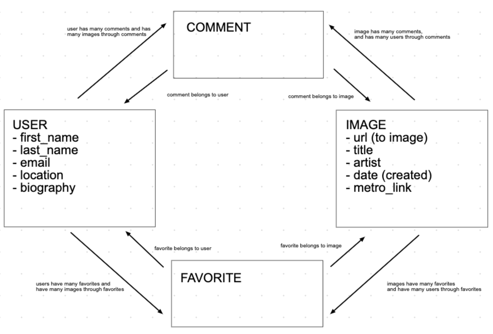
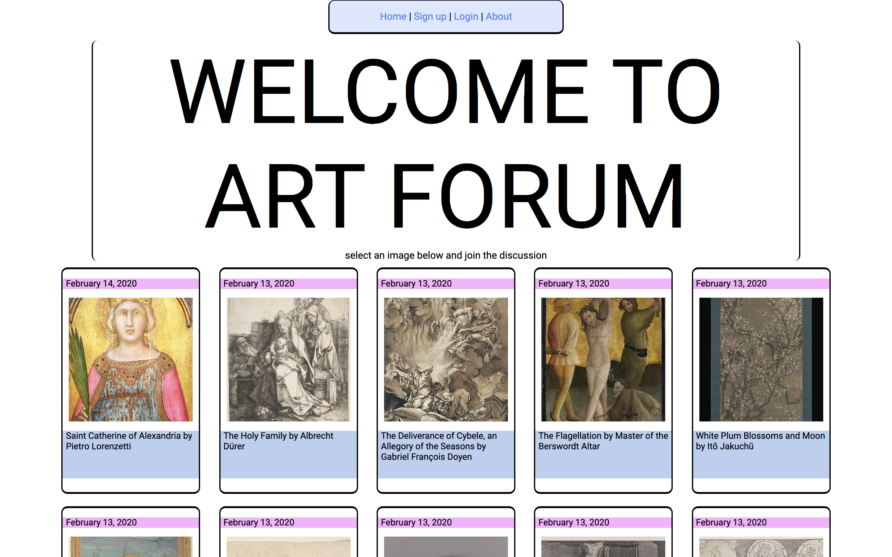
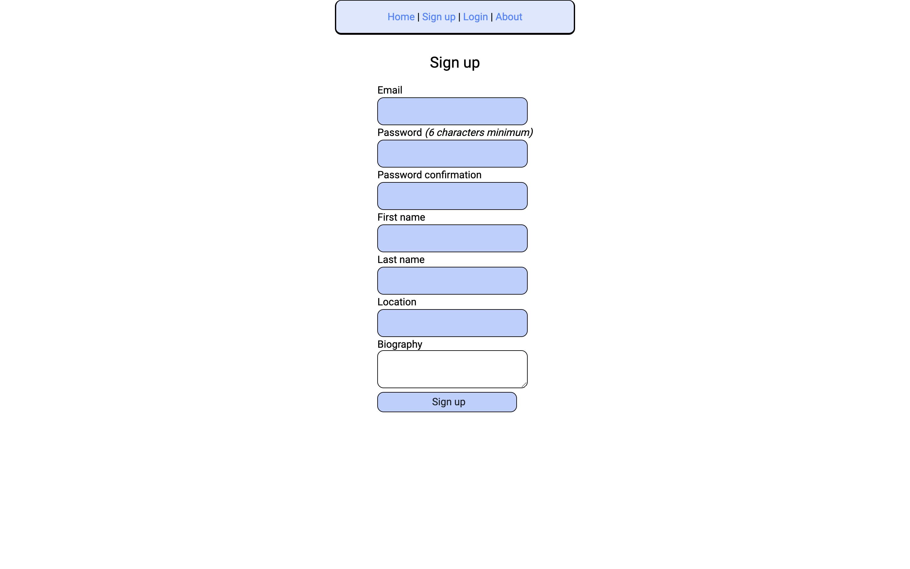
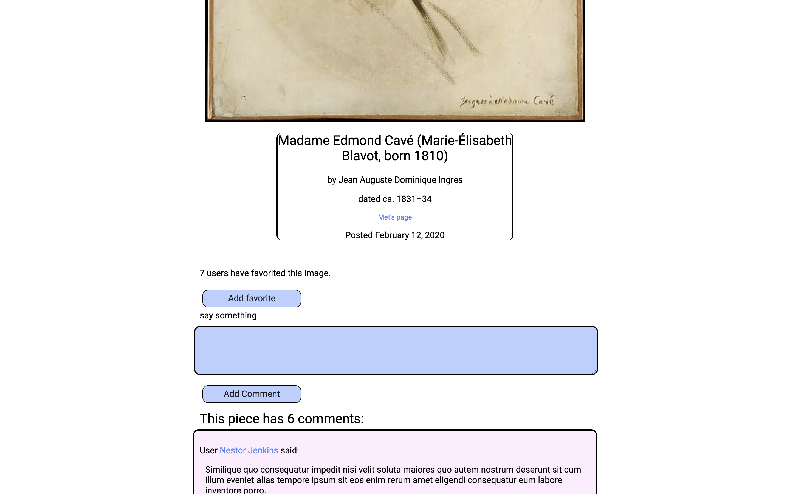

# Art Forum 

Art Forum is a social site meant to connect users with art and each other. 

## Background 

Art Forum was created to exemplify my understanding of Ruby on Rails and proper web application construction, including proper routing, use of views, models, and controllers, and web page design. Art Forum was used for my mod 2 project during my time in Flatiron School's Immersive Software Engineering program. 

The intent behind Art Forum was to make an application that could connect art lovers to each other. Each day a new image from The Metropolitan Museum of Art's API is added to the site's collection of images. Users are able to comment on images and add images to their list of favorite images. Stretch goals included following other users, but I did not implement this before the project deadline. 

Ultimately, Art Forum is a proof-of-concept of an application that can connect people over their love of art; specifically, people who may not have the means to see art in world famous museums. While planning the application, I thought of those who did not grow up near amazing museums or in artistic communities like I was lucky enough to, and wanted to create a tool to connect those people to new art in an easy to access manner. 

## Functionality

Users can: 

-  Create an account, including their email address, encrypted password, first and last names, location, and biography. 

- View all pieces or one piece of art from The Metropolitan Museum of Art's API. 

- Comment on pieces. 

- Edit or delete their comments. 

- Add pieces to their list of favorites. 

- Remove pieces from their list of favorites. 

- View their own or other's profile page, which includes their information, comments, and favorite pieces. 

## Association Wireframe

Models, their attributes, and associations: 



## Tools and Technologies 

Ruby on Rails 6 was used to build the application. I used Faker to make seed data, rest and JSON gems for parsing The Met's API for art data, Devise for authentication and authorization, and vanilla CSS for styling. 

-  [Ruby on Rails 6](https://rubyonrails.org/)

-  [Faker](https://github.com/faker-ruby/faker)

- [REST Client gem](https://github.com/rest-client/rest-client)

- [JSON gem](https://rubygems.org/gems/json/versions/1.8.3)

-  [The Metropolitan Museum of Art API](https://metmuseum.github.io/)

- [Devise](https://github.com/heartcombo/devise)

## Installation 

The installation process assume you have Ruby on Rails installed and know how to navigate your terminal. 

Run the following in your terminal (Mac and Linux): 

```
# clone this repo

git clone git@github.com:tylergreason/artForum.git art_forum

# cd into the new directory 

cd art_forum

# bundle/install the necessary gems 

bundle install

# migrate the database 

rails db:migrate

# seed the database 

rails db:seed

# start a rails server

rails s
```

Navigate to localhost:3000 in your browser to view the site. 

## Usage 

To create an account, select Sign up from the homepage: 






Select any image from the homepage and scroll below the image to comment on it: 



## Challenges and What I Learned

-  Scope 
    -  The scope of Art Forum felt very intimidating in the beginning. I spent a weekend planning Art Forum but never felt fully prepared until I started actually _writing_ code, then things came together nicely and mostly went smoothly. I learned that while it is important (necessary!) to plan your project extensively, you may never feel prepared enough, and taking a dive into starting to make the project may be the best next step. 

-  Planning 
    - Though I had some experience with CSS before this project, Art Forum was the largest project I had tackled using CSS. I am proud of the way Art Forum is presented but the CSS in its current state feels flimsy and poorly built. I learned that planning what I wanted to make before making it is a practice not reserved for databases and code structure, but the way a site is presented as well. Less repeated code, fewer selectors, and taking advantage of SCSS would have been beneficial. 

-  Test, test, test!  
    - No wonder knowing how to write tests is such a highly sought after skill. A few times corner-case situations popped up that broke Art Forum. I either fixed the issue to make it work properly or removed the user's ability to perform the action that caused the issue (not ideal, but I was on a time crunch!). I learned to test my application for as many scenarios as I could think of, and the real benefit of having testing suites to do that for me. 
